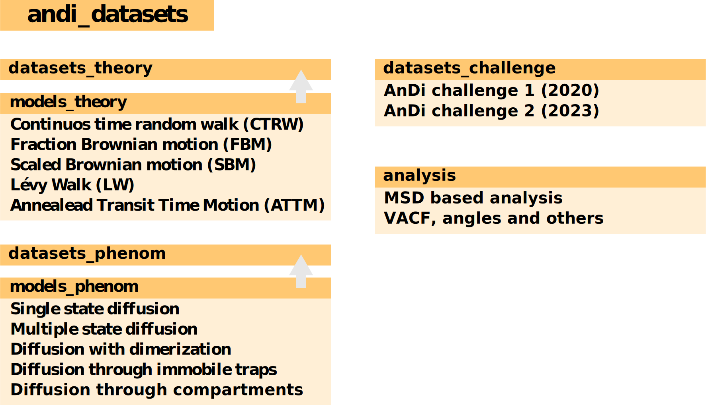

# `andi_datasets 2.0.0` version changes

This blog recapitulates the main changes of the `andi_datasets` library. These have two goals: simplify and standarize how to access the different available diffusion models, and most importantly, include the diffusion models that will be considered during the second ANDI challenge.

### Name change: `andi-datasets` is now `andi_datasets`
Using a hyphen in the library's name carried some problems. Mainly, due how  `pip` and `python` deal with them. In our case, in order to install the library, you had to use `pip install andi-datasets` (sadly, the package `andi` already exists...), but the to import the package, you had to call `import andi`. This was inconsistent, and carried some other problems, mostly related to the `nbdev` package (see below). That is way we have changed the name of the package, such that now, it is found in pip as

`pip install andi_datasets`

and is imported in `python` via `import andi_datasets`.

### Library structure
One of the main changes is that we have switched to a [nbdev](https://github.com/fastai/nbdev)-like library, where all the code is developed in notebooks and the compiled into `.py` files via the ndbev compiler. In terms of the library usage, nothing has really changed (aside of all the listed below), but we find that this way of developing code will help us maintain a better package and ease adding new features.

Then, we have restructured the whole package to accommodate the new diffusion models as well as standarize the use of the library. Here is a little scheme of how the library is organized:

In summary, the classes `datasets_XXX`  are used to generate, save and load the trajectories generated by the classes `models_XXX`. These store the diffusion models, either theoretical or phenomenological. The former were used for the ANDI 2020 challenge. You can find more details about them in the [challenge's paper](https://www.nature.com/articles/s41467-021-26320-w) or in this *updated* [notebook tutorial](tutorials/challenge_one_datasets.ipynb). The latter are the basis of the ANDI 2022 challenge and are simulated by means of fractional brownian motion plus some extra tweaks. You can start playing around with this models and learn from them via this [notebook tutorial](tutorials/challenge_two_datasets.ipynb).

On the other hand, we have created a completely new class that gathers the generators for the various Challenge datasets. This allows you to generate datasets similar to the ones that will be used in challenge. Note that the one for Challenge 2 is subject to changes!

We have also created a new class, called `analysis` that allows you to access common analysis methods for diffusion trajectories, as for instance MSD based fittings for the diffusion coefficient and anomalous exponents, calculations of the velocity autocorrelation function,...

Last, we have organized the different auxiliary functions in three files: 

- `utils_videos` allows to merge our library with [`deeptrack`](https://github.com/softmatterlab/DeepTrack2). This allows to generate experimentally realistic videos from the trajectories you create with `andi-datasets`. A tutorial about it can be found in the Tutorials tab.

- `utils_trajectories` gathers all functions related to the creation of trajectories.
-  `utils_challenge` gathers all functions needed to correctly prepare the trajectories and its labels for their use in the AnDi Challenge. It also contains the metrics and the evaluators for the second challenge.

### Accessing diffusion models
To be fair, accessing directly the diffusion models in the last version was a bit messy. That's what new versions are here for! Let's focus first on the theoretical models. Now they can simply be from the `models_theory` class. Their inputs stay the same as before (`alpha` for anomalous exponent and `T` for the length of the trajectory). We have added an extra variable to set the dimension of the diffusion easily. To give an example, a 3D trajectory of ATTM can now be easily created using:

	 from andi_dataset.models_theory import models_theory
	
	 trajectory = models_theory().attm(alpha = 0.8, T = 10, dimension = 3)

Again, more examples on this theoretical models are given in their corresponding [tutorial notebook](tutorials/challenge_one_datasets.ipynb)

For the new phenomenological models, it works the same! However, in this case we have a few more parameters than just the anomalous exponent. You can explore them [here](tutorials/challenge_two_datasets.ipynb).

### Other changes

- Variable name change in `models_theory().create_dataset`: `N` is now  `N_model`. In this way, it is more clear that `N_model` refers to number of trajectories per model and we use `N` for total number of trajectories in other functions.
- Corrected how noise is applied in Task3. Now the noise is added after the segmentation. This ensures that two subsequent segments don't have different noises.
- Added an extra variable in `datasets_challenge().challenge_2020_dataset`, `return_noise` which, if `True`, makes the function output the noise amplitudes added to each trajectory. This will help users to get all the information they need when creating their datasets.
- Change how noise is applied in `models_theory.challenge_2020_dataset`, such that all components of trajectories with dimension 2 and 3 have the same noise amplitude.
