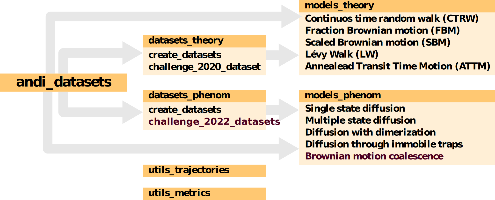

# The Anomalous Diffusion (AnDi) dataset library

[](https://doi.org/10.5281/zenodo.4775311)

This library has been created in the framework of the [**Anomalous Diffusion (AnDi) Challenge**](http://andi-challenge.org/) and allows to create trajectories and datasets from various anomalous diffusion models. You can install the package using:


```
pip install andi-datasets
```

You can then import the package in a Python3 environment using:

```python
import andi_datasets
```


### 1st AnDi Challenge 2020

The first AnDi challenge was held between March and November 2020 and focused on the characterization of trajectories arising from different theoretical diffusion models under various experimental conditions. The results of the challenge are published in this article: [Muñoz-Gil et al., Nat Commun **12**, 6253 (2021)](https://doi.org/10.1038/s41467-021-26320-w).

If you want to reproduce the datasets used during the challenge, please check [this tutorial](https://github.com/AnDiChallenge/andi_datasets/blob/master/tutorials/challenge2021_submission.ipynb). You can then test your predictions and compare them with the those of challenge participants in this [online interactive tool](http://andi-challenge.org/interactive-tool/).

### 2nd AnDi Challenge 2022

We are currently preparing the second edition of the AnDi Challenge. Stay tuned, more info will be announced soon in [Twitter](https://twitter.com/AndiChallenge). If you want to start playing with the new *phenomenological* diffusion models on which the challenge will be based, you can check [this tutorial](https://github.com/AnDiChallenge/andi_datasets/blob/master/tutorials/challenge2022_datasets.ipynb).


## Library organization

The `andi_datasets` class allows to generate, transform, analyse, save and load diffusion trajectories from a plethora of diffusion models and experimental generated with various diffusion models. The library is structured in two main blocks, containing either theoretical or phenomenological models. Here is a scheme of the library's content:




### Theoretical models

The library allows to generate trajectories from various anomalous diffusion models:  [continuous-time random walk (CTRW)](https://journals.aps.org/prb/abstract/10.1103/PhysRevB.12.2455), [fractional Brownian motion (FBM)](https://doi.org/10.1137%2F1010093), [Lévy walks (LW)](https://doi.org/10.1103%2FPhysRevE.49.4873), [annealed transit time model (ATTM)](https://doi.org/10.1103%2FPhysRevLett.112.150603) and [scaled Brownian motion (SBM)](https://doi.org/10.1103%2FPhysRevE.66.021114). You can generate trajectories with the desired anomalous exponent in either one, two or three dimensions.

Examples of their use and properties can be found in [this tutorial](https://github.com/AnDiChallenge/andi_datasets/blob/master/tutorials/challenge2020_datasets.ipynb).

### Phenomenological models

 We have also included models specifically developed to simulate realistic physical systems, in which random events alter the diffusion behaviour of the particle. The sources of these changes can be very broad, from the presence of heterogeneities either in space or time, the possibility of creating dimers or bigger clusters or condensates or the presence of immobile traps in the environment.

Examples of their use and properties can be found in [this tutorial](https://github.com/AnDiChallenge/andi_datasets/blob/master/tutorials/challenge2022_datasets.ipynb).

## Contributing

The AnDi challenge is a community effort, hence any contribution to this library is more than welcome. If you think we should include a new model to the library, you can contact us in this mail: andi.challenge@gmail.com. You can also perform pull-requests and open issues with any feedback or comments you may have.

## Requirements

All current requirements are declared in the file `setting.ini`.

Further details can be found at the [PYPI package webpage](https://pypi.org/project/andi-datasets/).
